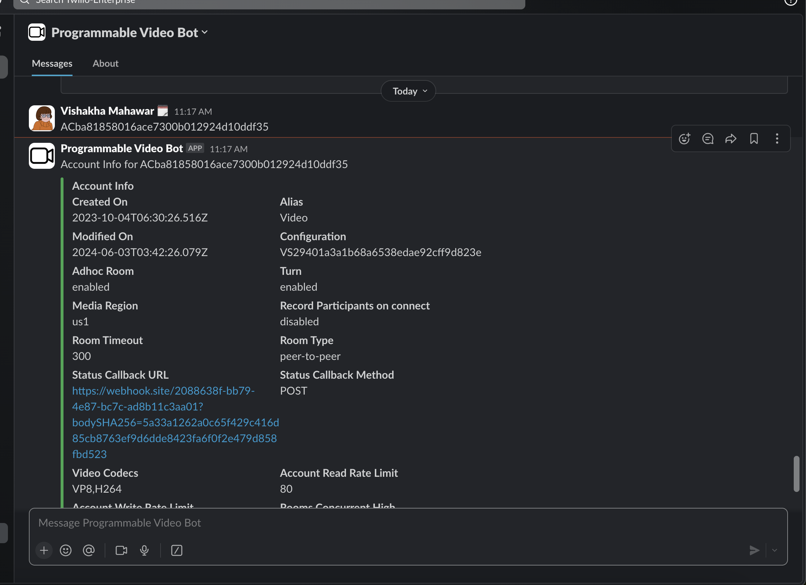
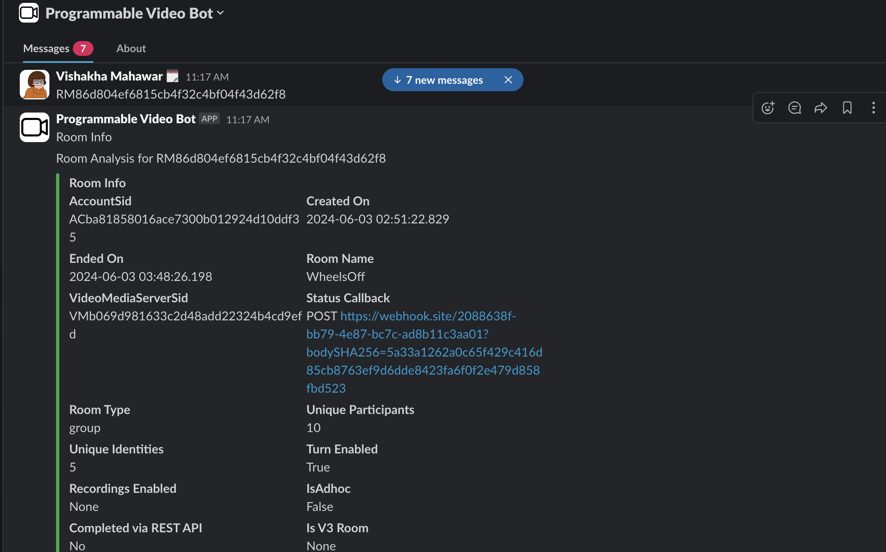
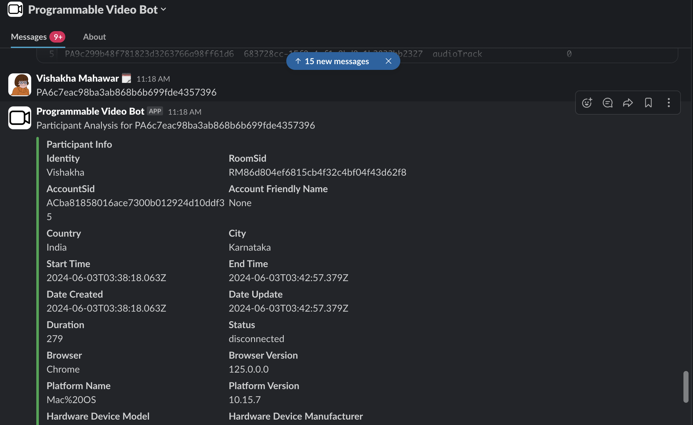
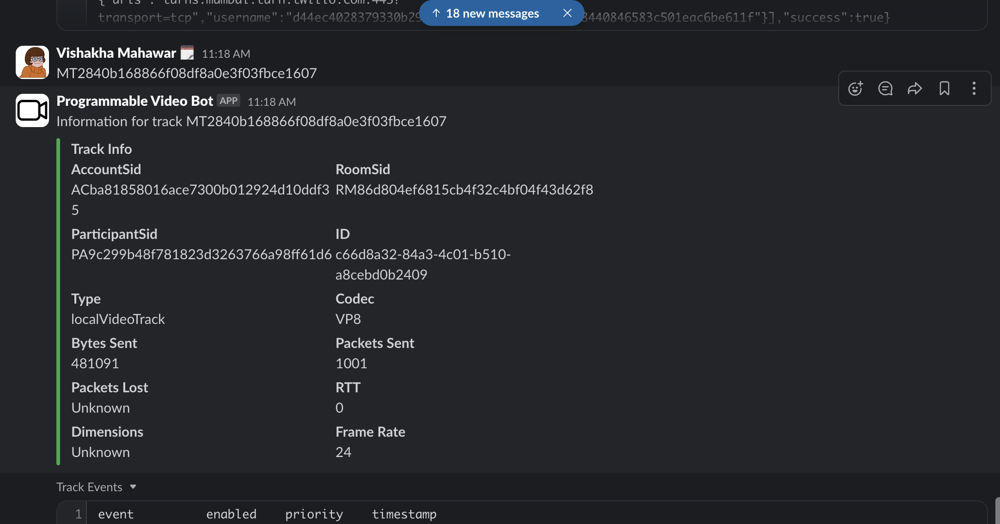

Type "help" into the @Programmable-Video Bot - an app you need to add in slack.  Use the commands based on your own video logs based on SIDs from the video react demo app.
Please use every command at least twice with various switches. Take screenshots and/or send the pop-out shareable (make sure you allow it) URLs; add these to the GH Repo and file.

