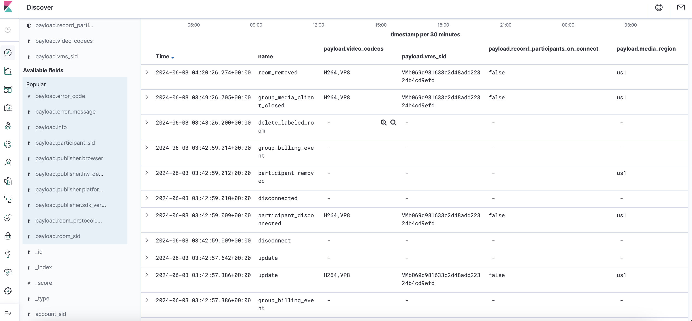
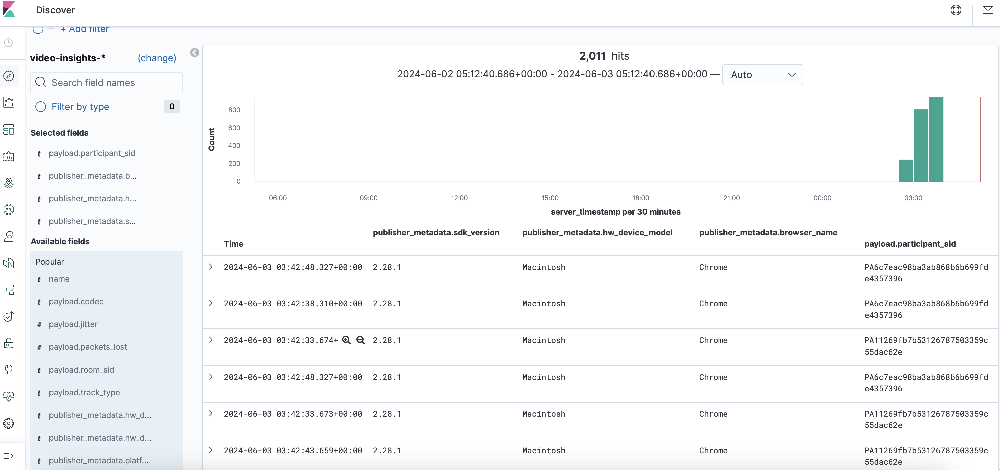
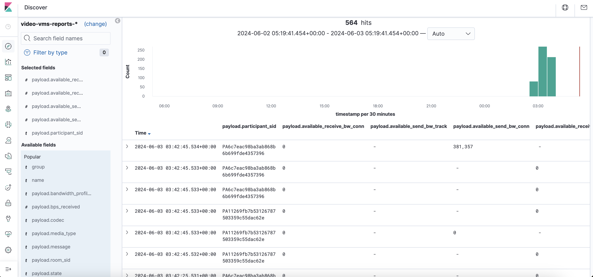
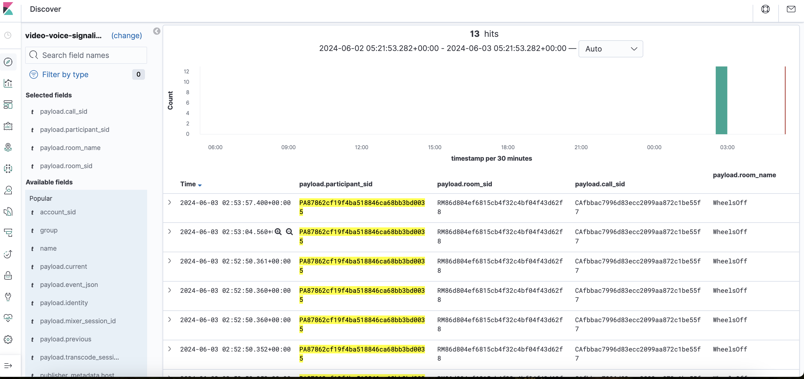
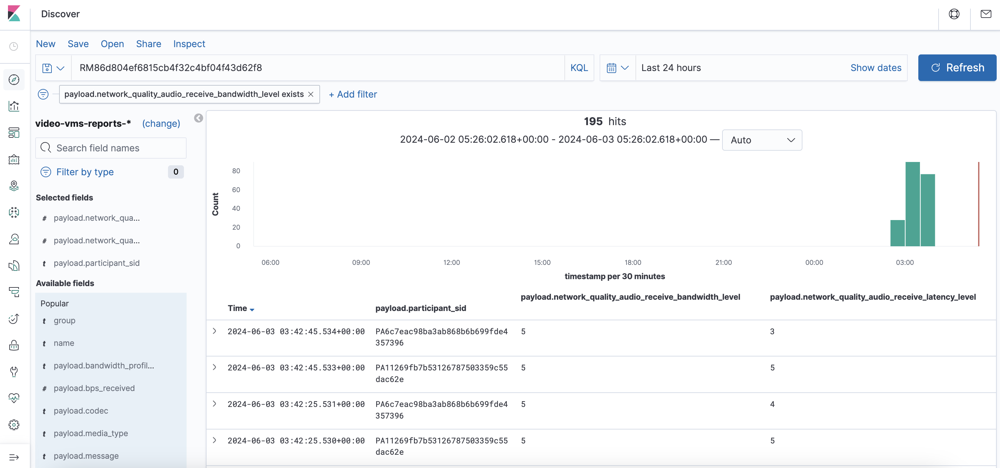
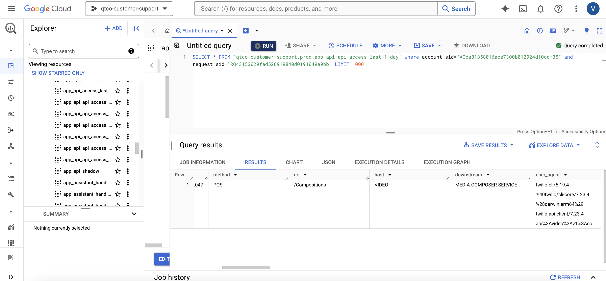

Kibana Links:
Change Index to sdki-rooms* create a "Discover URL" that displays media region, codecs, vms server sid, whether the participant was "recorded on connect" for all of the participants in one of your group rooms. : https://kibana.us1.eak.twilio.com/video/goto/057e2b8ba4dc71ad9e7a68405ee635f1

Change Index to video-insights* create a "Discover URL" that displays all device, manufacture, OS, browser version, SDK version information for the participants. Add shareable short URL for Kibana Link to Document and take a screenshot of using Kibana and add to GitHub Document.: https://kibana.us1.eak.twilio.com/video/goto/3a0d0fd1c643ce5c4c4cf9d067600c96

Change Index to video-vms-reports* create a "Discover URL" that displays all actual bandwidth for each participant in one room. Add shareable short URL for Kibana Link to Document and take a screenshot of using Kibana and add to GitHub Document.:https://kibana.us1.eak.twilio.com/video/goto/c9e34ac1525d20cfeb5cd70e556e2886

Change Index to video-voice-signaling* create a "Discover URL" that displays Participant SID, Call SID, Room SID, Identity, Room Name for the PSTN participant in one room. Add shareable short URL for Kibana Link to Document and take a screenshot of using Kibana and add to GitHub Document.:https://kibana.us1.eak.twilio.com/video/goto/1057306db932d202827560fc80d1a0fehttps://kibana.us1.eak.twilio.com/video/goto/1057306db932d202827560fc80d1a0fe

Create a "Discover URL" that displays all the Network Quality scores for all participants in one of your group rooms. Add shareable short URL for Kibana Link to Document and take a screenshot of using Kibana and add to GitHub Document.: https://kibana.us1.eak.twilio.com/video/goto/501c164f2a9c67588c32e442d4d91886

Using a SQL Query, find your API Request for the compositions you created. Add SQL Query and a shareable link to Google spreadsheet with the results from Quantico to a GitHub Document.: https://console.cloud.google.com/bigquery?sq=359385078535:20a951538f5e40c4acc797286cf30505

